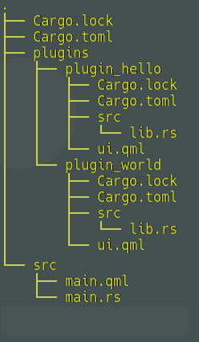

# Rust-QT Терминал с Плагинами

Кроссплатформенное десктопное приложение на **Rust** и **QT** с поддержкой **динамически загружаемых плагинов**.
Каждый плагин — это динамическая библиотека скомпилированных (`.so` / `.dll` / `.dylib`) из исходного кода rust и файла `ui.qml`. Достаточно положить плагин в папку `plugins/`, и приложение автоматически его подхватит и отобразит интерфейс.

---

## Возможности

- Приложение на **Rust** + **QT**
  - Логика и загрузка плагинов на Rust
  - Интерфейс полностью на QML
- **Динамическая загрузка плагинов**
  - Поддержка плагинов без пересборки основного приложения
  - Каждый плагин может регистрировать свои типы QML и UI
- Список UI-файлов плагинов доступен через свойство `pluginUrls`, привязанное к `ListView`
- Кроссплатформенность: Linux, Windows

---

## Структура проекта



## Сборка и запуск

### Зависимости

- Rust (stable)
- Qt 5 или Qt 6 (с QML)
- Библиотека [`qmetaobject`](https://github.com/woboq/qmetaobject-rs)

### Сборка и запуск основного приложения

```bash
cargo build --release
```

### Приложение

Сканирует папку plugins/

Загружает каждую библиотеку lib*.so

Вызывает у каждой функцию plugin_entry(&mut QmlEngine)

Добавляет путь к ui.qml в список pluginUrls

Загружает QML-интерфейс и отображает каждый плагин через Loader

### Сборка и запуск плагинов

проделайте с каждым плагином (в соответствующей папке)

```bash
cd plugins/<path_to_plugin>

cargo build --release
```

После этого убедитесь, что .so или .dll лежат в папке plugins основного приложения

## Архитектура

- Основное приложение на Rust определёно как QObject, с Q_PROPERTY pluginUrls

- Плагины реализуются как cdylib и экспортируют plugin_entry, вызываемую при загрузке

- Каждый плагин может зарегистрировать свои типы через qml_register_type

- Интерфейсы загружаются в QML через Loader, источники — ui.qml каждого плагина

## 📌 Будущие улучшения

Обратная связь между плагином и приложением (через сигналы/слоты)

Горячая перезагрузка плагинов при изменении файлов

Поддержка WebSocket и отображение графиков (candlesticks) через Canvas

Использование кастомных QQuickItem и Rust+SceneGraph
